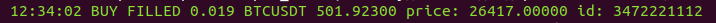
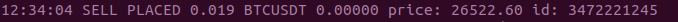

# BinFutures
Trading bot for Binance exchange.

Бот BinFutures.   
Бот для торговли на Binance Futures USDⓈ-M с использованием стратегии Мартингейла (усреднения- увеличения позиции с целью улучшения средней цены входа) и выбором растущей (падающей) монеты. Может работать и в LONG и в SHORT.  
Если не хочется использовать усреднения, можно:   
- выставить limit_aver в 0, 
- или включить использование stop_loss, установить его срабатывание до усреднения и бот будет закрывать позицию в минус, если курс пойдет не в нужную сторону,   
- или установить значение  min_bal_perc на 100% и бот не будет выставлять усредняющий ордер.   

   Бот может работать в одном из 4-х режимов:
1.  Режим стандартный- перебор пар для выбора подходящей по всем заданным условиям: 
  - объем торгов за 24 часа в USDT больше указанного в настройках;
  - объем торгов последней свечи или предпоследней больше объема выбранной дальней свечи на %, указанный в настройках;
  - изменение текущей цены по отношению к цене открытия дальней свечи:
    с подрежимом delta_start1- при LONG рост цены больше, чем на указанный %,
                             - при SHORT падение цены еще больше, чем на указанный %,
    с подрежимом delta_start2- при LONG падение цены еще больше, чем на указанный %,
                             - при SHORT рост цены больше, чем на указанный %.
    
2. Режим super_asset: бот работает с парой без каких-либо условий до отключения.

3. Режим control_auto: выбор подходящей пары заданным условиям стандартного режима и работа с ней до истечения указанного таймера от старта позиции в этом режиме, или достижения стоп_цены (изменения на указанный % от цены старта).

4. Режим most_changed- перебор пар для выбора подходящей по следующим условиям: 
  - объем торгов за 24 часа в USDT больше указанного в настройках,
  - курс пары за последние 24 часа изменился в заданном коридоре (с выбором ближе к максимальному или минимальному значению коридора).
  
    Режимы super_asset, control_auto и most_changed взаимоисключающие, т.е. при выборе одного из режимов другие режимы отключаются. Если не выбран ни один из режимов, бот будет работать в стандартном режиме.
    После выбора монеты в одном из режимов бот:
- покупает ее (встает в LONG) маркет-ордером (старт-ордер) на указанный объем (при работе в SHORT продает), 
- выставляет купленные монеты на продажу (для закрытия позиции в плюс) лимитным sell-ордером (FIX-ордером) по курсу на указанный процент прибыли выше курса покупки (в SHORT-е на покупку лимтным buy-ордером) ,
- выставляет лимитный buy-ордер (усред-ордер) на покупку этой же монеты по курсу ниже предыдущей покупки на указанный процент (на случай падения курса монеты и уменьшения средней цены входа в сделку)(в SHORT-е лимитный SELL-ордер на случай повышения курса).

Затем, в зависимости от того, какой ордер исполнился (примеры для LONG, для SHORT- наоборот):
- если исполнился sell-ордер (FIX-ордер), бот фиксирует прибыль и отменяет buy-ордер (усред-ордер) для усреднения(если buy-ордер при этом успел исполниться частично или полностью- выставляется sell-ордер), затем снова ищет подходящую пару,
- если исполнился buy-ордер (усред-ордер), бот отменяет sell-ордер (FIX-ордер),выставляет новый sell-ордер (FIX-ордер) уже с новым количеством монет и по новой цене(средняя цена входа + указанный процент прибыли), выставляет новый buy-ордер (усред-ордер),
- если buy-ордер (усред-ордер) исполнился больше, чем наполовину и прошло более 5-ти минут после этого , бот отменяет sell-ордер (FIX-ордер), и выставляет новый sell-ордер (FIX-ордер) уже с новым количеством монет и по новой цене(средняя цена входа + указанный процент прибыли).

Рекомендуется BinFutures установить на VPS сервер ubuntu 20/22 и запускать в SCREEN (чтобы бот не отключался при разрыве SSH-соединения с VPS), настроить telegram-бот и канал, куда будет приходит информация о работе бота.
 
- Остановка бота командой:      ctrl+c    (важно!: не останавливайте бот в момент совершения сделок, возможна ошибка записи в базу данных бота).
- В white_list (список пар для работы) можно внести от 1 пары до нескольких сотен пар, главное, чтобы котируемая валюта была USDT (ETHUSDT, BTCUSDT, XRPUSDT и т.д.), 
- min_order должен быть больше, разрешенного биржей.
- При работе с парами к USDT активы должны находится на фьючерсном балансе USDT, если работаете с парами к BUSD, активы должны находится на фьючерсном балансе  BUSD.
- Для прокрутки экрана терминала вверх есть команда: ctrl+a, esc и далее стрелка вверх. Для выхода из этого режима: esc, esc.

Для работы BinFutures можно использовать BNB для оплаты комиссий биржи (нужно перевести нужное количество BNB на фьючерсный счет в лк binance) и следить за наличием BNB на Futures аккаунте.

После закрытия каждой сделки BinFutures:
- отправляет сообщение в telegram-канал, 
- каждую минуту в описание канала отправляет информацию об открытой позиции, 
- в полночь в канал отправляет суточный отчёт о работе. Если не было прибыли за сутки, то суточный отчёт в telegram не придёт. Точные данные по прибыли наблюдать лучше в лк binance, так как бот показывает приблизительные значения.

Настройки бота (в основном описано для LONG, для SHORT применяется наоборот):
- fix_perc: процент повышения цены для продажи при LONG или падения для SHORT,
- step_aver: ввод step_aver1, step_aver2, ... step_aver7 шагов изменения цены для выставления усредов,
- qty_aver: ввод qty_aver, кратного увеличения объема усредняющего ордера в формате 7 чисел через пробел (например, 1 1.2 1.3 1.4 1.5 1.6 2),
- limit_aver: разрешенное количество усреднений (от 0 до 30), 
- min_order: минимальная покупка (продажа) в котируемой валюте (например, в паре ETH/USDT это USDT, ставить не меньше, чем разрешено биржей, например 6, и учитывайте, что в зависимости от выбранного leverage (кредитного плеча) будет использоваться меньше USDT, например: если min_order указан 20, а leverage указан 10, то для ордера будет использовано 20/10=2 USDT),
- min_bal_perc: минимальный процент от депозита, ниже которого BinFutures не будет выставлять усредняющий ордер, 
- delta_start: процент изменения цены для входа в сделку, нужно выбрать delta_start1 или delta_start2:  
- delta_start1: для LONG на сколько % должен подняться курс от цены открытия выбранной свечи до текущей для старта (для SHORT пишем со знаком минус, на сколько % должен упасть курс от цены открытия свечи до текущей), 
- delta_start2: для LONG пишем со знаком минус, на сколько % должен упасть курс от цены открытия выбранной свечи до текущей для старта (для SHORT на сколько % должен подняться курс от цены открытия свечи до текущей),
- delta_vol_start- на сколько % должен увеличиться объем торгов последней закрытой свечи по сравнению с объемом выбранной дальней свечи,
- control_auto: режим удержания подходящей по стандартным параметрам пары всегда в позиции до достижения условий по изменению цены или времени,   
- delta_stop: на сколько % должна изменится цена для возврата после закрытия позиции в перебор-поиск пары,   
- time_stop_ca: время удержания пары всегда в позиции после старта из перебора-поиска пары в минутах,
- most_changed: режим выбора в коридоре измен цены за последн 24ч,    
- delta24_min: min изменение цены в коридоре для most_changed,     
- delta24_max: max изменение цены в коридоре для most_changed,      
- select_delta24: выбирать ближе к max или min для most_changed,
- delta_vol_most_ch, вместо select_delta24 смотреть объем последних 2-х 15м свечей в коридоре измен цены за последн 24ч и выбрать пару с большим изменением,     
- stop_loss: на сколько % должен измениться курс монеты от средней цены входа для закрытия в минус,
- use_stop_loss: включить использование stop_loss для закрытия в минус (да/нет), если усред-ордер будет частично исполнен, то stop_loss не сработает , 
- pause_after_stop_loss: ставить BinFutures на паузу после срабатывания stop_loss и закрытия позиции по рынку или продолжить работу,
- completed: поставить бота на паузу при закрытии очередной сделки (1-вкл/0-выкл),
- kline_interval: интервал свечей для анализа (1m, 3m, 5m, 15m, 30m, 1h, 2h, 4h, 8h, 12h, 1d, 3d),
- interval_limit: какое количество свечей анализируем (если следим за изменением цены за последние 3 минуты, то можно выбрать kline_interval 1m и interval_limit 3),
- super_asset: пара для бесконечной торговли независимо от delta_start, при этом пары из white_list не будут работать (вводится командой -super_asset_add в формате ETHUSDT),
- manual_aver: команда для ручного усреднения по рынку, не дожидаясь цены лимитного усред-ордера, но не сработает, если усред-ордер, выставленный ботом, исполнен частично ('PARTIALLY_FILLED'),
- fix_loss: команда для закрытия открытой позиции по рынку, 
- clear: сброс из базы данных сведений об открытых ботом ордерах,
- leverage: размер кредитного плеча от 1 до 120 (оно разное для разных пар, смотрите в лк биржи),
- marginType: ISOLATED или CROSSED
- direction: LONG или SHORT (менять направление работы LONG/SHORT строго рекомендуется в терминале и при отсутствии открытых позиций)
- clear_profit: сброс из базы данных сведений о прибыли,
- t_sleep: при получении от биржи ошибки о превышении лимита api-запросов, можно выбрать значение паузы в секундах (например: 0.5, 1, 3),
- t_sleep_perebor: пауза перед повтором перебора монет для выбора подходящей для старта (по умолчанию 30 сек),
- white_list: список пар, которые бот будет использовать для анализа и выбора подходящей для открытия сделки,
- api_key: открытый api-ключ от биржи с разрешением на фьючерсную торговлю,
- api_secret: секретный api-ключ от биржи,
- botID: api телеграм бота полученный от @BotFather (пример: 5656544920:AAHrXhjhujhfdf7RPJlheqJXEulBW),
- channelID: ID канала telegram бота для уведомлений, полученное от @userinfobot (пример: -1001656543985),
- tguserid: ID основного user-a телеграм, полученное от @userinfobot (пример: 346549043)
- licens_key: лицензионный ключ для продления периода работы бота, полученный от разработчика,   
- quoteVolume24hr: минимальный 24-х часовой объем торгов в котируемой валюте (в паре ETH/USDT это USDT), чтобы бот взял пару из white_list в работу.  

При изменении marginType, direction, leverage убедитесь, что нет открытых позиций

Здесь BinFutures представлен для ознакомления и использования в течении пробного периода до 01 ноября 2023 г.
Если Вы хотите увеличить время работы до 1/6/12 месяцев: напишите в телеграм, по данным, указанным при запуске BinFutures.
При использовании бота на тестовой бирже срок работы 2 недели после запуска.

Если хотите испытать BinFutures на фьючерсной тестовой бирже Binance- 
переходите на:
https://testnet.binancefuture.com/ru/futures/
Где получите тестовые api-ключи, пропишите их в настройках бота, в use_testnet запишите: да, и экспериментируйте.

BinFutures поставляется по принципу «как есть». Никаких гарантий не прилагается и  не  предусматривается. Вы берете на себя весь риск относительно использования этого бота и должны понимать, что торговля на криптобиржах сопряжена с повышенным риском, и подходить к управлению рисками со всей ответственностью. 

Пояснения по установке, запуску, настройке бота и телеграм, screen, ошибке на  VPS utf-8.

Иногда бот может получить от биржи неправильные ответы на api-запросы и выдавать ошибку, поэтому рекомендуется периодически заглядывать в лк binance, и, если бот показывает открытые ордера а в лк binance их нет (или наоборот), нужно использовать команду -clear, чтобы сбросить в боте данные о неактуальных ордерах.
Редко, но бывает, что сервера telegram кратковременно недоступны, и в этот момент сообщение от BinFutures может не доходить в канал бота. 
Для управления ботом на VPS сервере с телефона можно использовать приложение JuiceSSH (или другое для SSH-соединения).

Если возникла ошибка 'code: -4061' «Order’s position side does not match user’s setting», значит биржа не дает открыть позицию, так как у Вас установлен хедж вариант торговли «Hedge Mode». Боту нужен односторонний режим "One-way".

Если при запуске бота на VPS выскакивает ошибка типа : "UnicodeEncodeError: 'latin-1' codec can't encode characters...", то нужно установить locale LANG=ru.
Решение №1:
dpkg-reconfigure locales
Далее выбираем все ru_RU.xx, и консоль по умолчанию в en_US.UTF-8
Решение №2:
sudo apt-get install language-pack-ru
sudo update-locale LANG=ru_RU.UTF-8
sudo apt-get install --reinstall locales

Установка и запуск BinFutures:
- на VPS-сервере ubuntu 20 или 22 создайте новую папку, например, BinFutures (mkdir BinFutures)
- зайдите в эту папку (cd BinFutures)
- перенесите в эту папку файл бота BinFutures-22 (или скачайте с github командой: wget https://github.com/ebot732/BinFutures/releases/download/BinFutures-22/BinFutures-22)
- откройте screen-сессию (например: screen -S BinFutures)
- дайте права запуска файлу (команда: chmod 755 BinFutures-22)
- запустите BinFutures (команда: ./BinFutures-22)
- команда для остановки бота: ctrl+c
- после запуска бота введите свои параметры: api_key и т.д.
- откорректируйте, при необходимости, настройки
- жмите ENTER и наблюдайте
- для выхода из SCREEN перед закрытием SSH-сессии используйте команду ctrl+a, d 
- для входа в screen работающего бота используйте команду: screen -x BinFutures

Для удобства настройки BinFutures используется телеграм бот, которого нужно сделать админом в телеграм канале. Необходимые данные телеграм бот возьмет из БД BinFutures и будет управляться через чат telegram-Botа. (https://github.com/ebot732/BinFutures/blob/main/README_telegram_uprav_bot.md)

Табличка BinFutures_averaged.xls ([https://github.com/ebot732/BinFutures/blob/main/table/BinFutures-19_averaged.xls](https://github.com/ebot732/BinFutures/raw/main/table/BinFutures-19_averaged.xls)) показывает приблизительные расчёты усреднений и цены ликвидации, точные данные смотрите в лк binance.

             Скриншоты

=================================================================

==================================================================

==================================================================

==================================================================      

    

==========================       
время |BUY/SELL| статус |кол-во| пара | сумма | цена | id ордера на бирже
   
Стартовый и усредняющие ордера в консоли выделены зеленым цветом.  

   
Ордер (FIX) для закрытия сделки по стратегии выделен фиолетовым цветом.

   
Строка состояния бота выделена желтым цветом.

